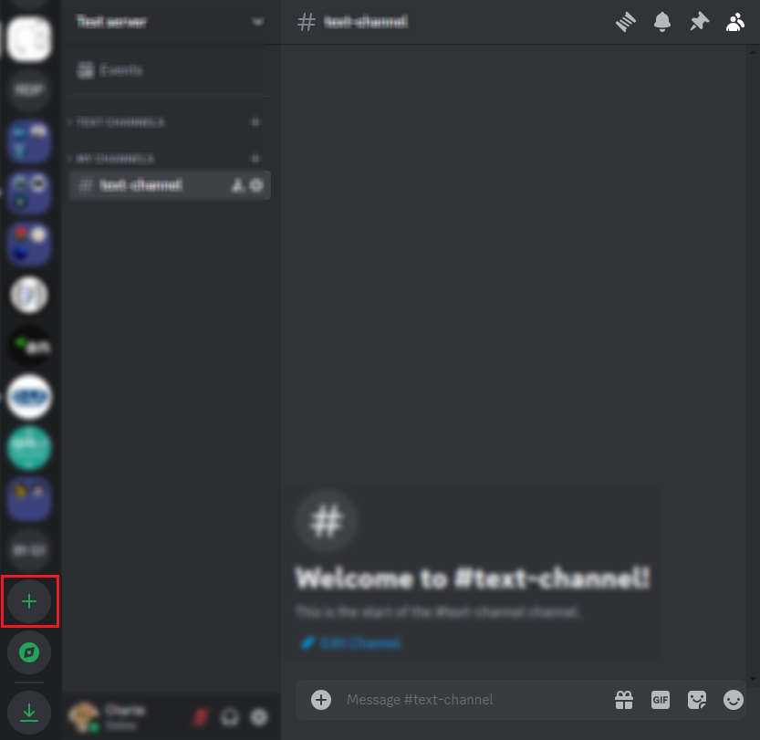
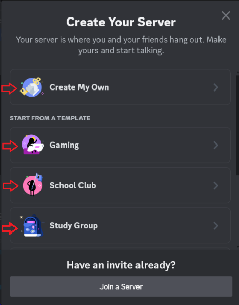
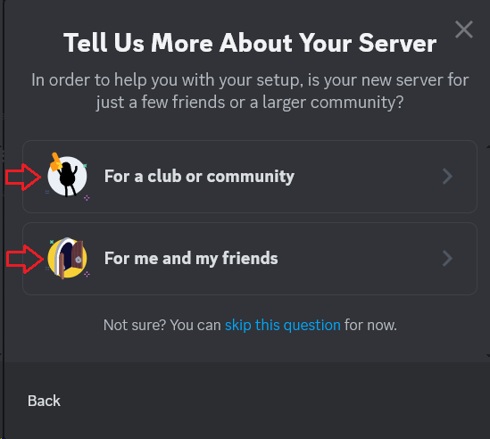
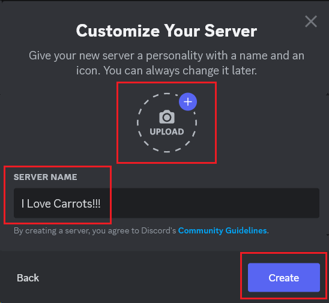
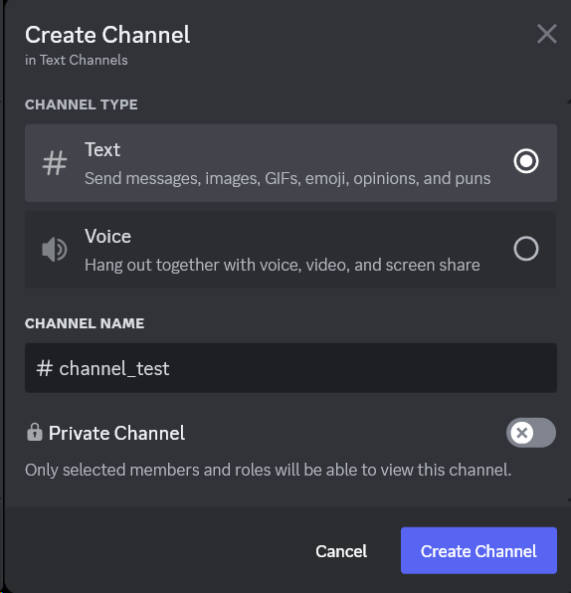
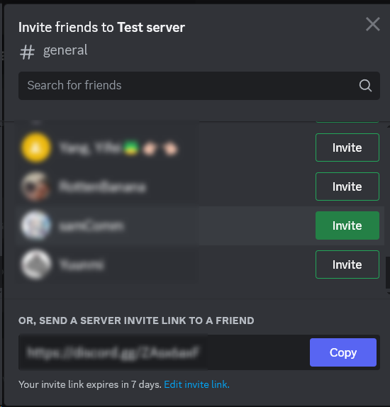

# Set Up Your Server

## Overview

You can learn how to create your first server and invite friends or classmates to join in this section.
Establish a private space for discussions, collaborations, or social gatherings by setting up your server.

## Create Your New Server

To begin with, you need to decide on the server's template and purpose, then customize it according to your purpose and
preferences. Here’s how you’ll set everything up:

1. Click the green **"+"** button on the left column.

{ width="600" }

A new window will appear and give you several options, you can create your own template or use the pre-defined
templates.

2. Click **"Create My Own"** or select a pre-defined Discord template, **"Gaming"**, **"School Club"**, or **"Study
   Group"**.

{ width="300" }

3. Choose the purpose of the server.

    The server can be for a small group of friends or a larger community. Skip this step if you are not sure for now.

{ width="300" }

4. Name your server and upload a characteristic photo. Complete the process by clicking **“Create”**.

{ width="300" }

## Create channels: voice and text

After creating your own server, you need to create channels based on specific needs.

1. Click the downward arrow { width="30" } next to your server name to open the
   dropdown menu.

2. Click **"Create Channel { width ="15" } "**  in the dropdown menu to create
   channel.

{ width="300" }

3. Select the type of channel you wish to create: text or voice, and provide it with a suitable name.

{ width="300" }

4. Select the privacy settings for the channel and then click  **"Create Channel"** to finish.

[//]: # (## Delete channels)

[//]: # ()
[//]: # (Sometimes, you might need to tidy up your server space by removing channels that are no longer needed.)

[//]: # (For instance, if you have created a temporary channel for a group project,)

[//]: # (you can delete it once the project is completed to keep your server organized.)

[//]: # ()
[//]: # (1. Hover over the channel you wish to delete and click on the gear icon)

[//]: # (   ![setting.svg]&#40;pictures%2Fsetting.svg&#41;{ width=" 20" }.)

[//]: # ()
[//]: # (![img_6.png]&#40;pictures/img_6.png&#41;{ width="300" })

[//]: # ()
[//]: # (You will be redirected to channel settings.)

[//]: # ()
[//]: # (2. Click **"Delete Channel ![dustbin.png]&#40;pictures%2Fdustbin.png&#41;{widith = "15"}"** on the left column.)

[//]: # ()
[//]: # (![deleteChannel.png]&#40;pictures%2FdeleteChannel.png&#41;{ width="600" })

[//]: # ()
[//]: # (!!! warning)

[//]: # ()
[//]: # (    Your channel will be permanently deleted. Proceed with caution.)

[//]: # ()
[//]: # (3. Confirm to delete by clicking "Delete Channel" when the warning window appears, as your channel will be)

[//]: # (   permanently deleted.)

[//]: # ()
[//]: # (![confirmDelete.png]&#40;pictures%2FconfirmDelete.png&#41;{ width="300" })

## Invite People to Your Server

After setup, you can expand your community by inviting your classmates and friends to join.

1. Click the downward arrow { width="30" } to open the dropdown menu.

2. Click **"Invite People {widith = "30"} "** in the dropdown menu to
   invite friends.

{ width="300" }

3. Choose your preferred method to send invites: click **"Invite"** for individual invites
   or click **"Copy"** to copy the link and share it via DM afterward.

!!! Note

    Using a link is typically more efficient when inviting multiple people.

{ width="300" }

!!! success

    By following the steps above, you have created a fully functional server with your first members joining.
    Congratulations on creating your private digital space!

## Conclusion

In this section, you learned how to:

- Create a server tailored to your needs
- Invite friends or classmates to join your server

You have taken the first step towards building your online community. Great work!