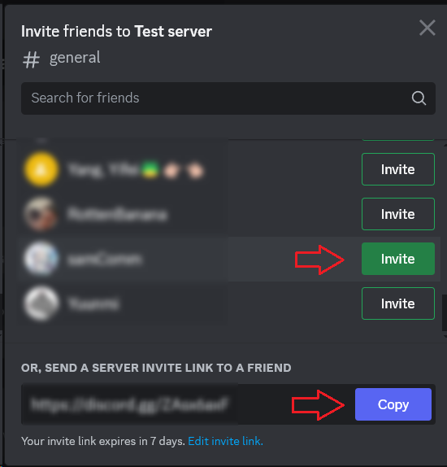

# Add Friends To Your Server

## Overview  
This section will guide you through the process of creating your own server and inviting friends or classmates to join. By building your own server, you can have a private space for discussions, collaborations, or social gatherings online.

## Create Your New Server 
To begin with, you need to decide on the server's template and purpose, then customize it according to your purpose and preferences. Here’s how you’ll set everything up:

### 1. Choose Server Template

Select a pre-defined Discord template or create a custom server. Discord provide templates for various needs 
such as Gaming, School Club, or Study Group.

### 2. Define Server Purpose 

Determine if the server is for a small circle of friends or a larger community. Skip this step if you are not sure for now.

### 3. Customize and Create Server 

Name your server and upload a representative photo. Finalize by clicking “Create”.

## Create channels: voice and text

After creating your own server, you need to build channels based on specific needs. 

### 4. Click to add channel

Click the dropdown arrow next to your Server name

In the dropdown menu, click on { width = '30'} to create channel

### 5. Customize and Create Channel

Decide whether your channel is text or voice channel. Name you channel and set whether it is private. Click “Create 
Channel ” to create the new channel

## Delete channels

You can also delete unwanted channels.

### 6. Click the “EDIT” button

Hover over the channel you want to delete, click the gear icon { width="30" } 
to access the channel settings.

{ width="300" }

### 7. Choose delete channel

In the channel settings, find the bin icon {widith = "30"}and click on it.

{ width="700" }

### 8. Confirm

A confirmation window will appear. Click "Delete Channel" to delete the channel.

{ width="300" }

!!! warning

    Your channel will be permanently deleted.

## Inviting People to Your Server

After setting up, it's time to grow your community by inviting others:

### 9. Navigate to Invite Section
Click the dropdown button next to the server name. In the drop-down menu, click the human icon {widith = "30"} to invite people.

### 10. Select and Send Invites

Choose to send direct invites or use a link. For multiple people invitation, a link is most efficient.

!!! success

    By following these steps, you should have a fully functional server with your first members joining.
    Congratulations on creating your private digital space!

## Conclusion  
In this section, you learned how to:

- Create a server tailored to your needs
- Invite friends or classmates to join your server

You've taken the first step towards building your online community. Great work!