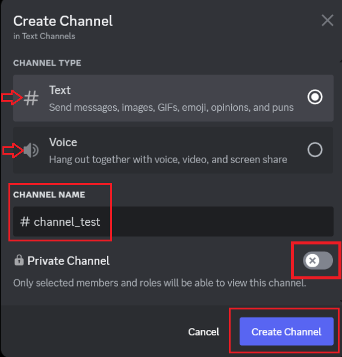

# Add Friends To Your Server

## Overview

This section will guide you through the process of creating your server and inviting friends or classmates to join.
By building your server, you can have a private space for discussions, collaborations, or social gatherings online.

## Create Your New Server

To begin with, you need to decide on the server's template and purpose, then customize it according to your purpose and
preferences. Here’s how you’ll set everything up:

1. Select a pre-defined Discord template or create a custom server.

     Discord provides templates for various needs such as Gaming, School Club, or Study Group.

{ width="300" }

2. Choose the purpose of the server.

    The server can be for a small group of friends or a larger community. Skip this step if you are not sure for now.

{ width="300" }

3. Name your server and upload a representative photo. Finalize by clicking **“Create”**.

{ width="300" }

## Create channels: voice and text

After creating your own server, you need to build channels based on specific needs.

1. Click the dropdown arrow next to your server name to open the dropdown menu.

{ width="300" }

2. Click { width = '30'} in the dropdown menu to create channel.

{ width="300" }

3. Select the type of channel you'd like to create: text or voice, and provide it with a suitable name.

{ width="300" }

4. Select the privacy settings for the channel and then click  **“Create Channel”** to finish.

## Delete channels

You can also delete unwanted channels.

1. Move the cursor to hover over the channel you want to delete, then click on the gear
   icon { width="30" }
   to open the channel settings.

{ width="300" }

2. Click **"Delete Channel {widith = "30"}"** on the left side in channel
   settings.

{ width="600" }

!!! warning

    Your channel will be permanently deleted. Proceed with caution.

3. Confirm the deletion by clicking "Delete Channel" when the warning window appears, as your channel will be permanently
   deleted.

{ width="300" }

## Inviting People to Your Server

After setting up, it's time to grow your community by inviting others:

1. Click the dropdown arrow next to your server name to open the dropdown menu. In the menu, click **"Invite
   People {widith = "30"} "** to invite people.

{ width="300" }

2. Choose your preferred method to send invites: either click the green **"Invite"** button or click **"Copy"** to copy the invitation link.

!!! Note

    Using a link is typically more efficient when inviting multiple people.

{ width="300" }

!!! success

    By following the steps above, you have created a fully functional server with your first members joining.
    Congratulations on creating your private digital space!

## Conclusion

In this section, you learned how to:

- Create a server tailored to your needs
- Invite friends or classmates to join your server

You have taken the first step towards building your online community. Great work!