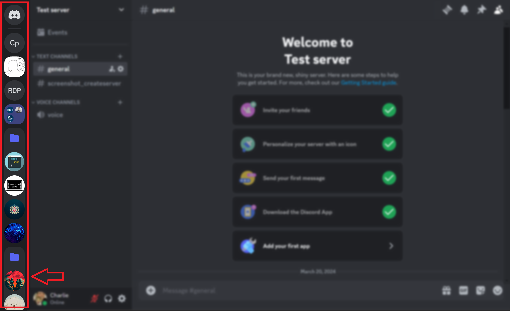
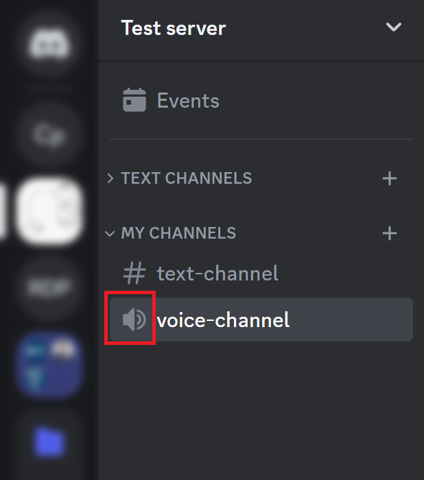
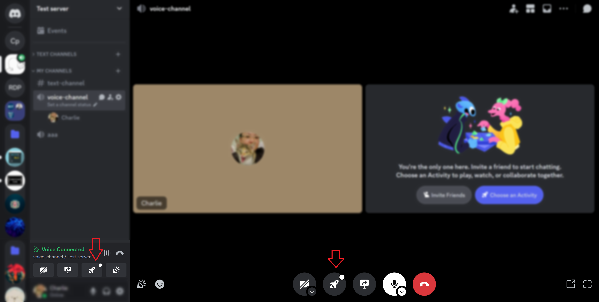
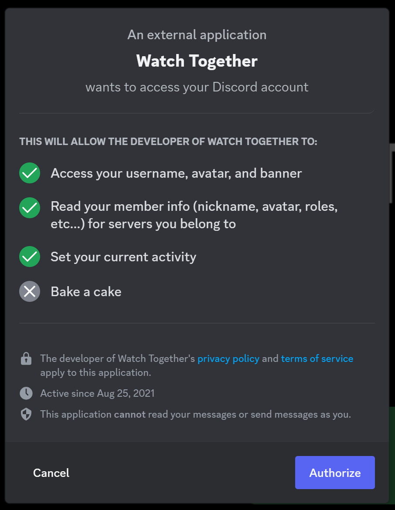
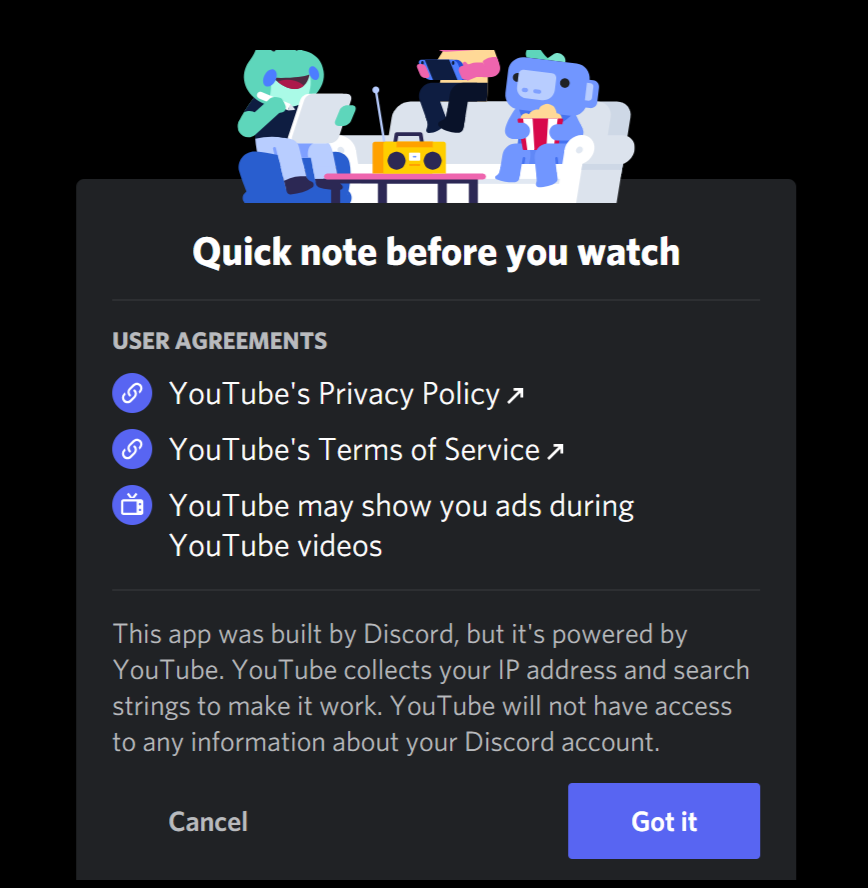
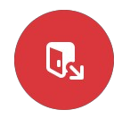
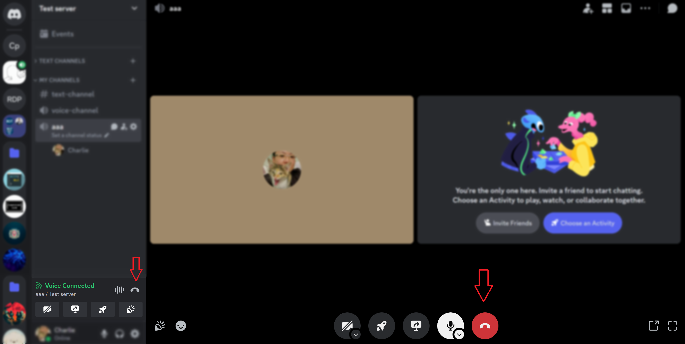

# Start Activities with Friends

You can enhance your Discord experience by hosting group voice and video chats with friends. 
In this section, you will learn how to start activities, such as watching YouTube videos together. 
By the end, you will have the basic knowledge to initiate and enjoy collaborative activities with your
friends on Discord.

## Host Group Voice & Video Chat

1. Select a server from the list on the left column.

{ width="600" }

!!! Note

    Your server lists may have different looks.

2. Select a channel with the microphone icon { width="15" } , click on the name of the
   channel to join a voice chat.

{ width="300" }

3. Start talking and adjust your microphone and camera settings if needed. 

!!! Note

    Toggle your microphone and camera on/off as needed using the microphone and camera icons.

## Start Group Activity

1. Click the rocket icon on your server tab or main chat screen to begin an activity.

{ width="600" }

2. Allow any on any pop-up windows if prompted by clicking **"Authorize"**, then **"Got It"**.

{ width="300" }
{ width="300" }

!!! Note

    You can right-click on the channel, and select "Invite People" to invite friends to join.

## Stream Video

1. Select **"YouTube"** from the activity list and wait for it to load.

2. Select a video to watch with your friends and click to add it to the playlist.

!!! Note

    Selected videos will automatically play upon selection, and multiple videos can be added to a playlist.

3. Hover over on video window and click **"Expand Video"** for better viewing.
    
    Enjoy watching the video together with your friends!

4. Click on the red door icon { width="35" } when done to exit the activity or start
   another videos or wish to start another activity. 
    
    You will return to the voice chat interface.

5. Click the phone icon { width="25" } to leave the voice channel.

{ width="600" }

## Conclusion

Congratulations! You have successfully learned how to host group voice and video chats on Discord by starting an
activity to watch YouTube videos together.
With the knowledge gained from this guide, you can now enjoy collaborative activities with your friends while using
Discord's features.

!!! Success

    You have mastered streaming videos with friends on Discord, 
    enhancing your group's online hangouts and creating memorable experiences together.