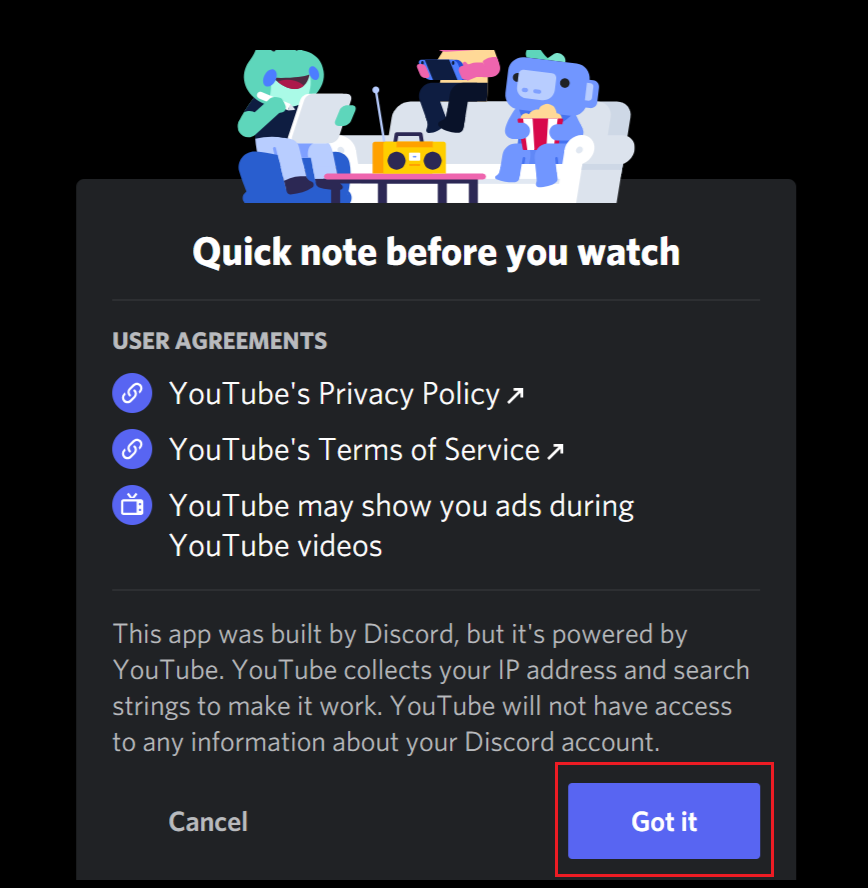

# Start activities with Friends

## Overview

In this user guide, you will learn how to host group voice and video chats on Discord,
specifically focusing on starting an activity to watch YouTube videos together.

By the end of this guide, you'll be equipped with the knowledge to initiate and enjoy collaborative activities with your
friends on Discord.

## Host Group Voice & Video Chat

### 1. Select a Server

Go to Discord's website and pick a server from the list on the left.

{ width="600" }

!!! note

    Your server lists may have different looks.

### 2. Join a Voice Chat

Select a channel with the microphone icon { width="15" } , click on the name of the channel
to join a voice chat.

{ width="300" }

### 3. Start Voice or Video Chatting

Start talking and adjust your microphone and camera settings if needed. 🗣️

!!! Additional Information

    Toggle your microphone and camera on/off as needed using the microphone and camera icons.

## Start group activity

### 4. Start an Activity

Begin an activity by clicking the rocket icon on your server tab or main chat screen.

{ width="600" }

### 5. Authorize and Start

Allow any on any pop-up windows if prompted by clicking **'Authorize'**, then **'Got It'**.

{ width="300" }
{ width="300" }
!!! Optional

    Have your friends join the Activity.
    To join, they need to be in the same Voice Channel as you and join the Activity you started.
    Each person joining the game will need to provide authorization if they’ve never played the chosen Activity before.

## Stream video

### 6. Select YouTube

Choose 'YouTube' from the activity list and wait for it to load.

### 7. Add Video to Playlist

Select a video to watch with your friends and click to add it to the playlist.

!!! note

    Selected videos will automatically play upon selection, and multiple videos can be added to a playlist.

### 8. Expand Video

Hover over the video window and click 'Expand Video' for better viewing.
Enjoy watching the video together with your friends!

### 9. Leave Activity

Click on the red door icon { width="35" } when done to exit the activity or start another.
videos or wish to start another activity,
You'll return to the voice chat interface.

### 10. Leave Voice Channel

Click the phone icon { width="25" } to leave the voice channel.

{ width="600" }

## Conclusion

Congratulations! You have successfully learned how to host group voice and video chats on Discord by starting an
activity
to watch YouTube videos together.
With the knowledge gained from this guide, you can now enjoy collaborative activities with your friends while using
Discord's features.

!!! Success

    You have mastered streaming videos with friends on Discord, 
    enhancing your group's online hangouts and creating memorable experiences together.